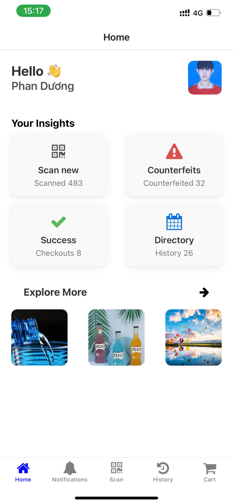
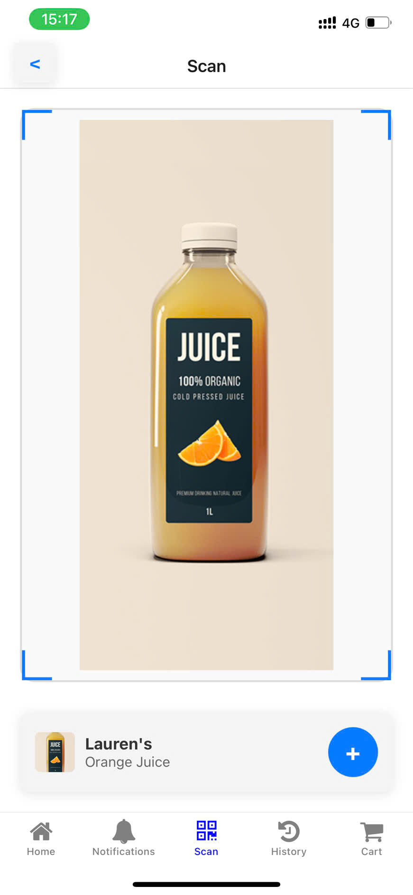

# Phan Đức Dương - MSV: 22810310282

# Kiểm tra 11/03/2025: Bar-Code-Scan-App
Link design: 
https://www.figma.com/file/j7cET0s1hS3wvgIBb94sXs/Bar-Code-Scan-App-(Community)-(Copy)-(Copy)?node-id=14%3A1094&mode=dev

Yêu cầu:
Hoàn thiện layout các màn hình: Home, Scan. (https://prnt.sc/bkpXCWQy5aqp)
- Sử dụng Stack Navigator và Bottom Tabs Navigator để di chuyển giữa các Screens.
Output:
Link git repo. Có file README.md ghi rõ thông tin và ảnh chụp kết quả màn hình
Ảnh chụp màn hình kết quả từng screen.
- Hoàn thiện vàn nộp bài đúng hạn.

